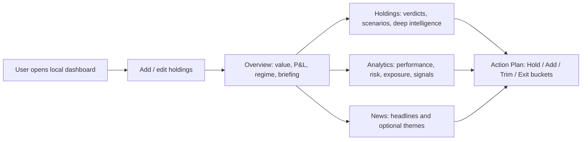
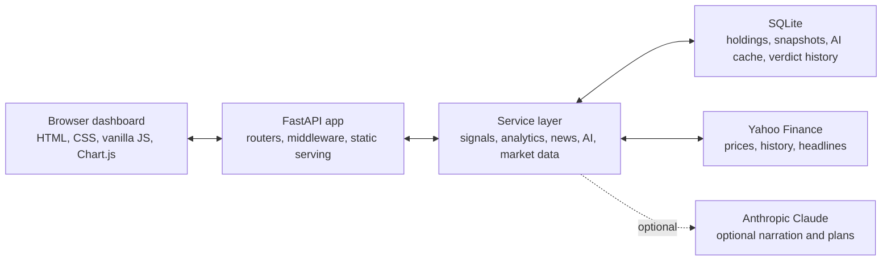

<p align="center">
  <picture>
    <source media="(prefers-color-scheme: dark)" srcset="static/img/brand/folio-orbit-mark-light.svg">
    <source media="(prefers-color-scheme: light)" srcset="static/img/brand/folio-orbit-mark-dark.svg">
    
  </picture>
</p>

<h1 align="center">FolioSenseAI</h1>

<p align="center"><em>Your folio, finally making sense.</em></p>

<p align="center">
  <strong>A local-first portfolio intelligence dashboard that turns holdings, market data, risk signals, news, and optional Claude narration into plain-English portfolio context.</strong>
</p>

<p align="center">
  
  
  
  
  
  
  <a href="LICENSE"></a>
</p>

<p align="center">
  <a href="https://github.com/udhawan97/FolioSenseAI/actions/workflows/ci.yml"></a>
  <a href="https://github.com/udhawan97/FolioSenseAI/actions/workflows/pylint.yml"></a>
  <a href="https://github.com/udhawan97/FolioSenseAI/actions/workflows/codeql.yml"></a>
</p>

<p align="center">
  <a href="#quick-start">Setup</a> ·
  <a href="#what-it-does">Features</a> ·
  <a href="#architecture-and-technical-layout">Architecture</a> ·
  <a href="#quality-checks">Quality</a> ·
  <a href="#troubleshooting">Help</a>
</p>

---

<p align="center">
  
  <br>
  <sub><em>Local dashboard, live market context, optional Claude explanations. Still not financial advice. Very much a dashboard.</em></sub>
</p>

## Quick Start

FolioSenseAI runs on your computer as a local web app at [http://localhost:8000](http://localhost:8000).

**Prerequisites**

- Python 3.11 or newer from [python.org](https://www.python.org/downloads/)
- Internet access for market data from Yahoo Finance through `yfinance`
- Optional: an Anthropic API key for Claude-powered briefings and action plans

**Mac / Linux**

```bash
git clone https://github.com/udhawan97/FolioSenseAI.git
cd FolioSenseAI
./scripts/setup.sh
```

**Windows PowerShell**

```powershell
git clone https://github.com/udhawan97/FolioSenseAI.git
cd FolioSenseAI
.\scripts\setup.ps1
```

The setup script creates a virtual environment, installs dependencies, creates local config if needed, prepares the `database/` folder, and starts the app.

For day-to-day use after setup:

```bash
./scripts/start.sh
```

```powershell
.\scripts\start.ps1
```

Keep the terminal window open while using FolioSenseAI. Closing it stops the local server.

## The Short Version

FolioSenseAI helps you understand what your portfolio is doing and why it might be doing it. Add holdings, open the dashboard, and it combines live prices, portfolio math, market regime context, risk analytics, headlines, and a modular signal engine into a more useful view than "line went up" or "line went down, emotionally."

The app works without an AI key. Local Intelligence handles the core verdicts, scenarios, exposure, analytics, and fallback summaries. If you bring a Claude key, FolioSenseAI can add richer action plans, portfolio briefings, news themes, and insight copy. Your portfolio database and `.env` stay local.

## At A Glance

| Signal | What FolioSenseAI does |
| --- | --- |
| Product purpose | A self-hosted portfolio intelligence dashboard for understanding holdings, risk, market context, and possible actions |
| Core workflow | Add or manage holdings, review live portfolio state, inspect per-ticker intelligence, scan analytics, read news, refresh action plans |
| AI / ML usage | Optional Anthropic Claude layer for narration, action plans, news themes, and insight text; deterministic local engine remains available without Claude |
| Privacy / data handling | Uses local SQLite storage, local `.env` config, local-first dashboard behavior, and optional external calls to Yahoo Finance and Anthropic |
| Setup | Python 3.11+, `pip install -r requirements.txt`, then `python run.py` or the included setup/start scripts |
| Engineering depth | FastAPI API, SQLAlchemy models, Pydantic schemas, modular services, caching, startup warmup, Chart.js dashboard, pytest coverage, CI, Pylint, CodeQL, dependency audit |

## Who This Is For

| Audience | Why it helps |
| --- | --- |
| Casual users | See portfolio value, P&L, movement explanations, market context, news, and plain-English verdicts without needing a spreadsheet ritual |
| Recruiters / hiring teams | Review a complete product-minded full-stack project: API design, data modeling, frontend UX, local-first privacy choices, caching, AI integration, tests, and release discipline |
| Developers | Run a compact FastAPI + SQLite + vanilla JS app locally, inspect the service boundaries, and extend one piece at a time |

## What It Does

| Area | Capability |
| --- | --- |
| Portfolio dashboard | 📊 Tracks holdings, watchlist positions, value, cost basis, daily change, unrealized gain, realized reductions, and allocation |
| Verdict engine | 🧭 Produces Hold / Add / Trim / Exit-style signals with confidence, time horizon, scenario context, and local fallback behavior |
| Action plan | ✅ Builds bucketed portfolio action plans with thesis text, priority moves, and regime context; Claude-enhanced when available |
| Holding intelligence | 🔎 Expands tickers into deeper equity or ETF context, market pulse details, peer-relative positioning, event flags, and contribution breakdowns |
| Analytics | 📈 Covers performance, risk, exposure, signals, market context, benchmark comparison, drawdown, beta, volatility, sector tilt, conviction gaps, and confidence spectrum |
| News | 🗞️ Fetches grouped news for active holdings and watchlist tickers; Claude mode can add portfolio-level news themes |
| Market context | 🌎 Pulls live quotes, historical prices, US market status, and major world market indices |
| Local configuration | 🔐 Lets users save a Claude API key from the dashboard, validates the key shape, writes `.env`, and reconnects without a restart |
| Cost visibility | 💸 Tracks live Claude token usage for the running process and exposes cache/cost stats through the AI API |

## Product Flow



The dashboard keeps the flow intentionally direct: enter holdings, understand the current state, inspect the drivers, then decide what deserves attention. It does not connect to a brokerage or place trades.

## Architecture And Technical Layout

<p align="center">
  
</p>



| Layer | Stack |
| --- | --- |
| Backend | Python 3.11+, FastAPI 0.136.3, Uvicorn 0.48.0 |
| Data | SQLite, SQLAlchemy 2.0.50, Pydantic 2.13.4 |
| Market data | `yfinance` 1.4.1 and Yahoo Finance |
| AI | Anthropic SDK 0.105.2, optional Claude calls, local deterministic fallback |
| Frontend | Single HTML shell, Bootstrap 5.3.2, Bootstrap Icons, Chart.js 4.4.0, vanilla JavaScript |
| Quality | pytest, Pylint, `compileall`, pip-audit, Dependency Review, CodeQL, security hygiene workflow |

```text
app/
├── main.py                 FastAPI app, middleware, static assets, startup warmup
├── config.py               Environment-backed settings
├── database.py             SQLite engine/session and startup migrations
├── models.py               SQLAlchemy ORM models
├── schemas.py              Pydantic request/response contracts
├── routers/                API route groups: stocks, portfolio, ai, news
└── services/               Market data, analytics, signals, AI, news, exposure, regimes

templates/
└── index.html              Dashboard shell

static/
├── css/style.css           Dashboard design system
├── js/dashboard.js         Main dashboard behavior
└── js/analytics-charts.js  Chart.js analytics widgets

scripts/                    Setup and start scripts for Mac/Linux/Windows
tests/                      Offline-focused pytest suite with mocked external services
docs/                       Dashboard screenshot and architecture diagram
```

## Why It Matters

Most portfolio tools show the number. FolioSenseAI works on the next question: what is behind the number?

That means turning raw holdings into a product workflow: live quote state, exposure context, portfolio-level risk, ticker-level explanations, market regime, news, and action buckets. The interesting engineering problem is not "call an AI model." It is deciding when deterministic local logic is enough, when narration adds value, how to cache expensive or slow work, and how to keep the dashboard useful even when an external service is unavailable.

For reviewers, the project is meant to show both implementation and product taste: a working local app, clear boundaries between routers and services, practical privacy defaults, a frontend without a build step, and enough tests to make changes without holding your breath.

## Release And Project Status

Current repo status: **v4.1**.

Implemented highlights:

- Local FastAPI dashboard with SQLite persistence
- Holdings management, watchlist support, portfolio value, P&L, and snapshots
- Modular investment signal and holding intelligence services
- Analytics, exposure, market regime, peer-relative, event, ETF quality, and projection services
- News feed plus optional Claude-generated news themes
- Optional dashboard-based Anthropic key configuration
- Local fallback behavior when Claude is not configured or reachable
- GitHub Actions for tests, linting, dependency audit/review, CodeQL, and repository hygiene

Known limits and roadmap:

- This is not a brokerage, tax tool, or financial advisor
- Market data depends on Yahoo Finance availability through `yfinance`
- Claude features require the user to provide an Anthropic API key
- CSV import/export and transaction history views are planned
- Verdict calibration data is being logged; reporting is a future improvement once enough history exists

See [RELEASE_NOTES.md](RELEASE_NOTES.md) for version-by-version changes.

## Setup, Updating, And Requirements

### Developer Setup

```bash
python3 -m venv venv
source venv/bin/activate
python -m pip install --upgrade pip
python -m pip install -r requirements.txt
cp .env.example .env
mkdir -p database
python run.py
```

Windows activation and copy commands:

```powershell
python -m venv venv
.\venv\Scripts\activate
python -m pip install --upgrade pip
python -m pip install -r requirements.txt
copy .env.example .env
mkdir database
python run.py
```

### Useful Local URLs

| URL | Purpose |
| --- | --- |
| [http://localhost:8000](http://localhost:8000) | Dashboard |
| [http://localhost:8000/docs](http://localhost:8000/docs) | Interactive Swagger API docs |
| [http://localhost:8000/health](http://localhost:8000/health) | Health check |

### Optional Claude Setup

FolioSenseAI works without Claude. To enable Claude-powered briefings and action plans, add an Anthropic key in either place:

- In the dashboard: click the brand mark, paste a valid `sk-ant-*` key, and save.
- In `.env`: set `ANTHROPIC_API_KEY=...` and restart the server.

The dashboard validates the key format before saving. AI responses are cached where appropriate so refreshes do not always mean new model calls.

### Updating

If you installed from Git:

```bash
git pull
python -m pip install -r requirements.txt
python run.py
```

If you used the release installer commands, run the installer again. The install scripts are designed to preserve existing `.env` and `database/` files.

## Privacy And Data Handling

FolioSenseAI is local-first, not cloud-hosted.

| Data | Handling |
| --- | --- |
| Holdings and portfolio snapshots | Stored in local SQLite under `database/` |
| Config and API keys | Stored in local `.env`; `.env` is excluded from git |
| Browser cache | Uses `localStorage` for faster dashboard paint |
| Market data | Requested from Yahoo Finance through `yfinance` |
| Claude prompts | Sent to Anthropic only when Claude features are enabled and requested |
| Generated AI summaries | Cached locally in SQLite for reuse and cost control |

Security-oriented defaults in the repo:

- `.env` and `database/` are intended to stay untracked
- CORS defaults to local origins
- API key input is format-validated client-side and server-side before being saved
- Claude is optional; the local engine remains available without an AI provider

## Quality Checks

Run these from an activated virtual environment:

```bash
python -m compileall -q app run.py tests
python -m pytest -q
python -m pylint $(git ls-files '*.py')
```

Optional dependency audit:

```bash
python -m pip install pip-audit
pip-audit -r requirements.txt
```

The GitHub workflow runs tests on Python 3.11 and 3.12, imports the FastAPI app, compiles Python sources, audits pinned dependencies, runs Pylint, checks CodeQL, reviews dependency changes on PRs, and blocks common local/generated files from being committed.

## Troubleshooting

| Symptom | Try this |
| --- | --- |
| `Python not found` | Install Python 3.11+ from [python.org](https://www.python.org/downloads/) and open a new terminal |
| Windows cannot find Python | Reinstall Python and check "Add Python to PATH" on the first installer screen |
| `localhost:8000` will not load | Make sure the terminal running `python run.py` or the start script is still open |
| Browser does not open automatically | Visit [http://localhost:8000](http://localhost:8000) manually |
| Port 8000 is busy | Stop the other local server or change the port in `run.py` |
| Market data looks empty | Check your internet connection and retry; Yahoo Finance requests can fail or rate-limit |
| AI shows Local mode | Add a valid Anthropic key through the dashboard key panel or `.env` |
| Claude request fails | Confirm the key starts with `sk-ant-`, has account credit/access, and restart if you edited `.env` manually |
| Pylint command fails on Windows | Use Git Bash, WSL, or run `pylint app tests run.py` |

## License

FolioSenseAI is released under the [MIT License](LICENSE).

This project is for education, analysis, and portfolio exploration. It is **not financial advice**, does not place trades, and should not be treated as a substitute for professional judgment.

<p align="center">
  Built to make portfolio context easier to read, easier to question, and slightly less spreadsheet-haunted.
</p>
