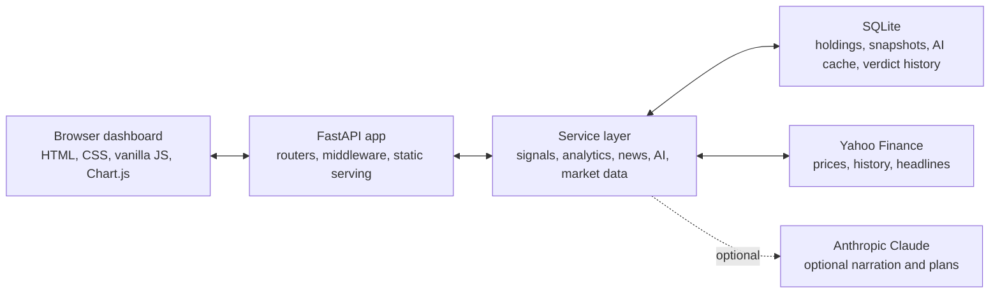

<p align="center">
  <picture>
    <source media="(prefers-color-scheme: dark)" srcset="static/img/brand/folio-orbit-mark-light-animated.svg">
    <source media="(prefers-color-scheme: light)" srcset="static/img/brand/folio-orbit-mark-dark-animated.svg">
    
  </picture>
</p>

<h1 align="center">FolioSenseAI</h1>

<p align="center"><em>Your folio, finally making sense.</em></p>

<p align="center">
  A local-first portfolio intelligence dashboard that turns holdings, market data, risk signals,<br>
  and news into plain-English answers to "wait, why did that happen?"
</p>

<p align="center">
  <a href="https://udhawan97.github.io/FolioSenseAI/">
    
  </a>
</p>

<p align="center">
  <sub><a href="https://udhawan97.github.io/FolioSenseAI/"><strong>udhawan97.github.io/FolioSenseAI</strong></a> — watch the dashboard work, then download it.</sub>
</p>

<p align="center">
  <a href="https://github.com/udhawan97/FolioSenseAI/releases/latest"></a>
  <a href="https://github.com/udhawan97/FolioSenseAI/actions/workflows/ci.yml"></a>
  <a href="https://github.com/udhawan97/FolioSenseAI/releases"></a>
  
  <a href="LICENSE"></a>
</p>

<p align="center">
  <a href="https://udhawan97.github.io/FolioSenseAI/">🌐 Website</a> ·
  <a href="https://udhawan97.github.io/FolioSenseAI/">📖 Docs</a> ·
  <a href="https://github.com/udhawan97/FolioSenseAI/releases/latest">⬇️ Download</a> ·
  <a href="#what-it-does">🧠 Features</a> ·
  <a href="#for-developers">🛠️ Developers</a>
</p>

---

## ⬇️ Download

Native desktop app — no Python, no terminal required.

| Platform | Download | Guide |
| --- | --- | --- |
| **macOS** (Apple Silicon) | [**Download .dmg**](https://github.com/udhawan97/FolioSenseAI/releases/latest) | [Install on macOS](https://udhawan97.github.io/FolioSenseAI/install-macos/) |
| **Windows** (x64) | [**Download .exe**](https://github.com/udhawan97/FolioSenseAI/releases/latest) | [Install on Windows](https://udhawan97.github.io/FolioSenseAI/install-windows/) |

All builds live on [GitHub Releases](https://github.com/udhawan97/FolioSenseAI/releases). Prefer to run from source? See [For developers](#for-developers).

> **Heads up:** early builds aren't code-signed yet, so macOS and Windows show a first-launch warning. That's expected for an open-source app — the [install guides](https://udhawan97.github.io/FolioSenseAI/download/) show exactly what you'll see, and every release ships a `SHA256SUMS.txt` so you can [verify your download](https://udhawan97.github.io/FolioSenseAI/download/#verify-your-download).

## What It Does

Most portfolio trackers stop at the number. Green means good, red means bad — and if you want to know *why*, that's a separate tab, a separate app, or a group chat with someone who read the news this morning and you didn't.

FolioSenseAI closes that gap: holdings, live prices, risk math, market regime, news, and optional Claude-written narration, all in one place that runs on your laptop and reports to nobody. It doesn't connect to a brokerage and it doesn't place trades — but it will tell you, with a straight face, whether your "diversified" portfolio is actually just four tech stocks in a trench coat.

| Do this | Get this |
| --- | --- |
| 📊 Add holdings and watchlist tickers | Live value, cost basis, daily change, unrealized gain, and allocation |
| 🧭 Open a ticker | A Hold / Add / Trim / Exit verdict with confidence, horizon, and scenario context |
| ✅ Check the action plan | Bucketed portfolio moves with thesis text, priorities, and regime context |
| 📈 Open Analytics | Performance, risk, exposure, beta, drawdown, volatility, sector tilt, and signals |
| 🗞️ Open News | Grouped headlines for everything you hold or watch, plus optional Claude themes |
| 📥 Import / export CSV | Move holdings in and out — a strict template locally, or let Claude map a messy brokerage export onto it |
| 🔐 Paste a Claude key | The dashboard validates it, writes `.env`, and reconnects — no restart |

> **Local Intelligence is not a downgraded mode.** It's the deterministic engine that runs the dashboard by default. Claude adds narration *on top* — it never gates the core experience, and everything it generates is cached in SQLite so refreshing doesn't mean paying again.

<p align="center">
  
  <br>
  <sub><em>The real dashboard, running a demo portfolio. Local market context, optional Claude explanations. Still not financial advice. Very much a dashboard.</em></sub>
</p>

## Meet Senpai


**Senpai** is the small orbiting mark in the corner of the dashboard — it watches your portfolio so you don't have to stare at it alone. It reads the room: sharp when Claude is narrating, dry on Local Intelligence, quietly sympathetic when Claude is offline. Tap it for a new line; it also talks on its own, whether you asked it to or not. Senpai doesn't manage your portfolio. Senpai has *opinions* about your portfolio. [Say hello →](https://udhawan97.github.io/FolioSenseAI/meet-senpai/)

<br clear="left">

## 🔭 What's Brewing

The app already earns its spot in your dock — but this is very much the opening chapter, and the lab is open. Here's what's *on the radar* for future releases. Think of it as a sneak peek through the workshop window, not a pinky promise carved in stone.

| | On the radar | The gist | Status |
| --- | --- | --- | --- |
| ⚖️ | **Target weights & drift** | Set the mix you're aiming for, then see at a glance how far today's prices have nudged you off plan. | Next up in the lab |
| 🗂️ | **More than one portfolio** | Give your retirement account and your fun-money account their own separate scoreboards. | On the radar |
| 🧾 | **A verdict report card** | The dashboard grading its own past Hold / Add / Trim calls — in public, no less. | On the radar |
| 🧮 | **Year-end realized recap** | A tidy "what did I actually lock in this year?" summary for when tax season comes knocking. | Next up in the lab |
| 💸 | **Income & dividends view** | See what your portfolio pays *you* back for the privilege of holding it. | Being explored |
| 🔮 | **A what-if simulator** | Preview a buy or a trim *before* you touch anything real. Regret-free rehearsals. | Being explored |

> **The fine print, minus the lawyers:** This roadmap is less of a blood oath and more of a friendly sneak peek. FolioSenseAI is built part-time, so priorities may shift and exact dates are deliberately missing in action — but the direction is clear: more useful, more polished, more delightful, one release at a time.

Got a feature you'd fight for? [Open an issue](https://github.com/udhawan97/FolioSenseAI/issues/new) — Senpai reads every one and has opinions about most.

## Install

The [desktop downloads](#️-download) are the easy path. If you'd rather run from source:

<details>
<summary><strong>Run from source (any platform, Python 3.11+)</strong></summary>

```bash
git clone https://github.com/udhawan97/FolioSenseAI.git
cd FolioSenseAI
./scripts/setup.sh          # Windows: .\scripts\setup.ps1
```

The setup script creates a virtual environment, installs dependencies, writes a local `.env`, prepares `database/`, and starts the app at <http://localhost:8000>. Day-to-day: `./scripts/start.sh` (or `.\scripts\start.ps1`).
</details>

<details>
<summary><strong>One-line install script</strong></summary>

Downloads the latest release and sets up a local Python environment. Read them first — they're short: [mac](scripts/install-mac.sh) · [win](scripts/install-win.ps1).

```bash
curl -fsSL https://raw.githubusercontent.com/udhawan97/FolioSenseAI/main/scripts/install-mac.sh | bash
```

```powershell
irm https://raw.githubusercontent.com/udhawan97/FolioSenseAI/main/scripts/install-win.ps1 | iex
```

Set `FOLIO_REF` (e.g. `latest-main`) to install a specific tag or the dev channel.
</details>

<details>
<summary><strong>Optional Claude setup</strong></summary>

FolioSenseAI works without Claude. To enable Claude-powered briefings and action plans, add an Anthropic key either in the dashboard (click the brand mark, paste an `sk-ant-*` key) or in `.env` (`ANTHROPIC_API_KEY=...`, then restart). The key format is validated before saving.
</details>

## For Developers

A compact FastAPI + SQLite + vanilla-JS app with no frontend build step — easy to run and pull apart one service at a time.

<details>
<summary><strong>Setup, run, and quality checks</strong></summary>

```bash
python3 -m venv venv && source venv/bin/activate
python -m pip install --upgrade pip
python -m pip install -r requirements.txt
cp .env.example .env
python run.py                       # http://localhost:8000

# Quality checks
python -m compileall -q app run.py tests
python -m pytest -q
python -m pylint $(git ls-files '*.py')
```

| URL | Purpose |
| --- | --- |
| `http://localhost:8000` | Dashboard |
| `http://localhost:8000/docs` | Interactive Swagger API docs |
| `http://localhost:8000/health` | Health check |
</details>

<details>
<summary><strong>Architecture &amp; project layout</strong></summary>



| Layer | Stack |
| --- | --- |
| Backend | Python 3.11+, FastAPI, Uvicorn |
| Data | SQLite, SQLAlchemy 2, Pydantic 2 |
| Market data | `yfinance` / Yahoo Finance |
| AI | Anthropic SDK (optional), local deterministic fallback |
| Frontend | Single HTML shell, Bootstrap 5, Chart.js, vanilla JS |
| Desktop | PyInstaller + pywebview → DMG (create-dmg) / EXE (Inno Setup) |
| Quality | pytest, Pylint, pip-audit, CodeQL, Dependency Review |

```text
app/            FastAPI app, config, DB, models, schemas, routers/, services/
desktop/        Desktop entry point (uvicorn + native window)
templates/      Dashboard HTML shell
static/         CSS, JS, brand assets
packaging/      PyInstaller spec, Inno Setup script, app icons
scripts/        Setup, start, install, and icon-generation scripts
tests/          Offline-focused pytest suite with mocked external services
docs-site/      Astro + Starlight docs + landing page
```
</details>

<details>
<summary><strong>Build the desktop installers</strong></summary>

```bash
python -m pip install -r requirements.txt -r requirements-desktop.txt
python -m PyInstaller packaging/pyinstaller/FolioSenseAI.spec
python packaging/pyinstaller/fix_macos_bundle_symlinks.py dist   # macOS only
# Smoke-test the frozen bundle:
#   macOS:   dist/FolioSenseAI.app/Contents/MacOS/FolioSenseAI --smoke
#   Windows: dist\FolioSenseAI\FolioSenseAI.exe --smoke
```

Then `create-dmg` (macOS) or `iscc` (Windows) wrap it into an installer. Full commands: [Build from source](https://udhawan97.github.io/FolioSenseAI/build-from-source/#build-the-desktop-installers).
</details>

## Release Workflow

Version lives in one place — `app/version.py`. Pushing a `v*` tag builds both installers on native GitHub runners, smoke-tests each frozen bundle, and only then publishes the DMG, EXE, and `SHA256SUMS.txt` to a GitHub Release. A red build never replaces a good release. Every merge to `main` also refreshes a rolling `latest-main` prerelease for testing.

```
main merge / v* tag → tests → build macOS + Windows → smoke test → GitHub Release → website buttons
```

Details and the code-signing roadmap: [Releases &amp; versioning](https://udhawan97.github.io/FolioSenseAI/releases-and-versioning/).

## Troubleshooting Install

<details>
<summary><strong>Common first-launch issues</strong></summary>

| Symptom | Fix |
| --- | --- |
| macOS: *"Apple cannot check it for malicious software"* | Expected (unsigned). **System Settings → Privacy &amp; Security → Open Anyway**. [Steps](https://udhawan97.github.io/FolioSenseAI/install-macos/#first-launch-the-gatekeeper-warning) |
| Windows: *"Windows protected your PC"* (SmartScreen) | Click **More info → Run anyway**. [Steps](https://udhawan97.github.io/FolioSenseAI/install-windows/#first-launch-the-smartscreen-warning) |
| Windows: blank window | Install the [WebView2 runtime](https://developer.microsoft.com/microsoft-edge/webview2/) and relaunch |
| Is my download genuine? | [Verify](https://udhawan97.github.io/FolioSenseAI/download/#verify-your-download) against the release's `SHA256SUMS.txt` |
| Data missing after update | It isn't — data lives outside the app, in your user data directory |

More setup and runtime help: [Troubleshooting &amp; FAQ](https://udhawan97.github.io/FolioSenseAI/troubleshooting/).
</details>

## Privacy

FolioSenseAI is local-first, not cloud-hosted. Holdings and snapshots live in local SQLite; config and API keys live in a local `.env` that's excluded from git. Market data is requested from Yahoo Finance; Claude prompts are sent to Anthropic *only* when you enable Claude features. Generated AI summaries are cached locally. Full detail: [Privacy &amp; data handling](https://udhawan97.github.io/FolioSenseAI/privacy/).

## Contributing

Issues and pull requests are welcome. For a feature, a short issue describing the use case before the PR saves a round trip. Keep changes scoped, run the quality checks above, and don't be surprised if Senpai has opinions about your diff.

## License

Released under the [MIT License](LICENSE). This project is for education, analysis, and portfolio exploration. It is **not financial advice**, does not place trades, and is not a substitute for professional judgment.

<p align="center">
  <sub>Built to make portfolio context easier to read, easier to question, and slightly less spreadsheet-haunted.<br>
  If FolioSenseAI talked you out of panic-selling on a red Tuesday, a star costs nothing and Senpai will absolutely take credit for it.</sub>
</p>
