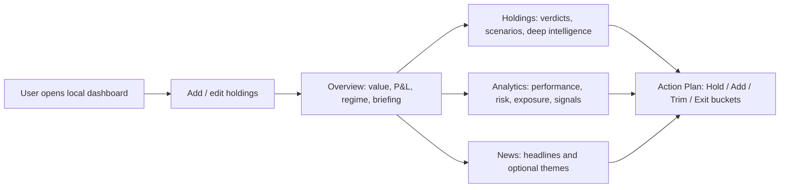
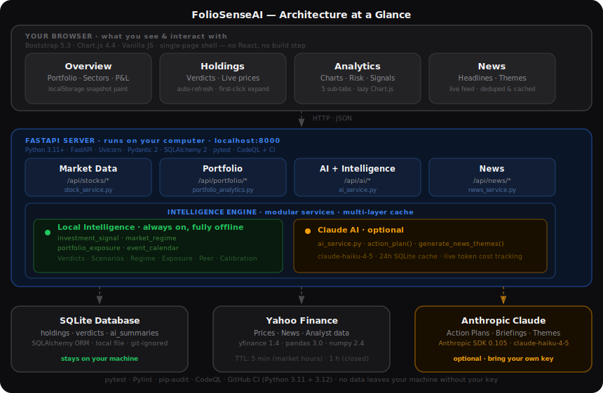
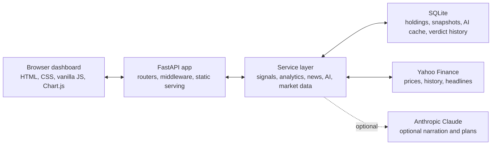

<p align="center">
  <picture>
    <source media="(prefers-color-scheme: dark)" srcset="static/img/brand/folio-orbit-mark-light-animated.svg">
    <source media="(prefers-color-scheme: light)" srcset="static/img/brand/folio-orbit-mark-dark-animated.svg">
    
  </picture>
</p>

<h1 align="center">FolioSenseAI</h1>

<p align="center"><em>Your folio, finally making sense.</em></p>

<p align="center">
  📦 Runs entirely on your machine &nbsp;·&nbsp; 🔒 Your database never leaves it &nbsp;·&nbsp; 🤖 Claude is a bonus, not a requirement
</p>

<p align="center">
  <strong>A local-first portfolio intelligence dashboard that turns holdings, market data, risk signals, and news into plain-English answers to "wait, why did that happen?"</strong>
</p>

<p align="center">
  
  
  
  
  
  
  <a href="LICENSE"></a>
</p>

<p align="center">
  <a href="https://github.com/udhawan97/FolioSenseAI/actions/workflows/ci.yml"></a>
  <a href="https://github.com/udhawan97/FolioSenseAI/actions/workflows/pylint.yml"></a>
  <a href="https://github.com/udhawan97/FolioSenseAI/actions/workflows/codeql.yml"></a>
</p>

<p align="center">
  📖 <a href="https://udhawan97.github.io/FolioSenseAI/">Full Docs</a> ·
  🚀 <a href="#quick-start">Setup</a> ·
  🧠 <a href="#what-it-does">Features</a> ·
  🐣 <a href="#meet-senpai">Meet Senpai</a> ·
  🏗️ <a href="#architecture-and-technical-layout">Architecture</a> ·
  🩹 <a href="#troubleshooting">Help</a>
</p>

---

<p align="center">
  
  <br>
  <sub><em>Local dashboard, live market context, optional Claude explanations. Still not financial advice. Very much a dashboard.</em></sub>
</p>

## The Problem With "The Line Went Up"

Most portfolio trackers stop at the number. Green means good, red means bad, and if you want to know *why*, that's a separate tab, a separate app, or a group chat with someone who read the news this morning and you didn't.

FolioSenseAI exists because "your portfolio is up 2.3%" is not an answer, it's a teaser. Somewhere behind that number is a sector rotation, an earnings beat, a rate decision, or a headline that decided your semiconductor position needed a personality today. This dashboard's whole job is closing that gap: holdings, live prices, risk math, market regime, news, and — if you want it — Claude-written narration, all sitting in one place that runs on your laptop and reports to nobody.

It does not connect to a brokerage. It does not place trades. It will, however, tell you with a straight face whether your "diversified" portfolio is actually just four tech stocks in a trench coat.

## Meet Senpai

<p align="center">
  
</p>

Every dashboard needs one thing staring back at you while your net worth does whatever it's doing today. That's **Senpai** — the small orbiting mark that lives in the corner of the dashboard, watching your portfolio so you don't have to stare at it alone.

Senpai isn't decoration. It reads the room: sharp and a little smug when Claude is connected and narrating your portfolio, dry and matter-of-fact when running on Local Intelligence alone, and quietly sympathetic on the rare occasion Claude is offline and the dashboard has to cope without the fancy words. Tap it and it'll cycle to a new line. It does this on its own too, every so often, whether you asked it to or not.

Senpai doesn't manage your portfolio. Senpai has *opinions* about your portfolio. There's a difference, and Senpai will absolutely make sure you know it.

## Quick Start

FolioSenseAI runs on your computer as a local web app at [http://localhost:8000](http://localhost:8000).

**Prerequisites**

- Python 3.11 or newer from [python.org](https://www.python.org/downloads/)
- Internet access for market data from Yahoo Finance through `yfinance`
- Optional: an Anthropic API key for Claude-powered briefings and action plans

**Mac / Linux**

```bash
git clone https://github.com/udhawan97/FolioSenseAI.git
cd FolioSenseAI
./scripts/setup.sh
```

**Windows PowerShell**

```powershell
git clone https://github.com/udhawan97/FolioSenseAI.git
cd FolioSenseAI
.\scripts\setup.ps1
```

The setup script creates a virtual environment, installs dependencies, creates local config if needed, prepares the `database/` folder, and starts the app.

For day-to-day use after setup:

```bash
./scripts/start.sh
```

```powershell
.\scripts\start.ps1
```

Keep the terminal window open while using FolioSenseAI. Closing it stops the local server.

> **Tip:** No Anthropic key, no problem. Local Intelligence handles verdicts, scenarios, exposure, and fallback summaries on its own — Claude just adds narration on top.

## At A Glance

| Signal | What FolioSenseAI does |
| --- | --- |
| Product purpose | A self-hosted portfolio intelligence dashboard for understanding holdings, risk, market context, and possible actions |
| Core workflow | Add or manage holdings, review live portfolio state, inspect per-ticker intelligence, scan analytics, read news, refresh action plans |
| AI / ML usage | Optional Anthropic Claude layer for narration, action plans, news themes, and insight text; deterministic local engine remains available without Claude |
| Privacy / data handling | Uses local SQLite storage, local `.env` config, local-first dashboard behavior, and optional external calls to Yahoo Finance and Anthropic |
| Setup | Python 3.11+, `pip install -r requirements.txt`, then `python run.py` or the included setup/start scripts |
| Engineering depth | FastAPI API, SQLAlchemy models, Pydantic schemas, modular services, caching, startup warmup, Chart.js dashboard, pytest coverage, CI, Pylint, CodeQL, dependency audit |

**Who it's for:** casual holders who want plain-English verdicts without a spreadsheet ritual, recruiters sizing up a full-stack product build, and developers who want a compact FastAPI + SQLite + vanilla JS app to run locally and pull apart one service at a time.

## What It Does

| Do this | Get this |
| --- | --- |
| 📊 Add holdings and watchlist tickers | Live value, cost basis, daily change, unrealized gain, and allocation, tracked automatically |
| 🧭 Open a ticker | A Hold / Add / Trim / Exit verdict with confidence, time horizon, and scenario context — local by default, Claude-narrated if connected |
| ✅ Check the action plan | Bucketed portfolio moves with thesis text, priorities, and regime context |
| 🔎 Expand a holding | Peer-relative positioning, event flags, contribution breakdowns, and deeper equity/ETF context |
| 📈 Open Analytics | Performance, risk, exposure, signals, benchmark comparison, drawdown, beta, volatility, sector tilt, and confidence spectrum |
| 🗞️ Open News | Grouped headlines for everything you hold or watch, plus optional Claude-written portfolio themes |
| 🌎 Glance at market context | Live quotes, historical prices, US market status, and major world indices |
| 🔐 Paste a Claude key | The dashboard validates it, writes `.env`, and reconnects — no restart, no editor |
| 💸 Check the cost HUD | Live Claude token usage and cache/cost stats for the running session |

**Three things worth knowing before you dive in:**

1. Local Intelligence is not a downgraded mode — it's the deterministic engine that runs the dashboard by default. Claude adds narration on top of it, not instead of it.
2. The holdings table auto-refreshes and expands on the first click. If you're waiting for a second click out of habit, you can stop.
3. Everything Claude-generated gets cached in SQLite, so refreshing the page doesn't necessarily mean paying for another model call.

## Product Flow



The dashboard keeps the flow intentionally direct: enter holdings, understand the current state, inspect the drivers, then decide what deserves attention.

## Architecture And Technical Layout

<p align="center">
  
</p>



| Layer | Stack |
| --- | --- |
| Backend | Python 3.11+, FastAPI 0.136.3, Uvicorn 0.48.0 |
| Data | SQLite, SQLAlchemy 2.0.50, Pydantic 2.13.4 |
| Market data | `yfinance` 1.4.1 and Yahoo Finance |
| AI | Anthropic SDK 0.105.2, optional Claude calls, local deterministic fallback |
| Frontend | Single HTML shell, Bootstrap 5.3.2, Bootstrap Icons, Chart.js 4.4.0, vanilla JavaScript |
| Quality | pytest, Pylint, `compileall`, pip-audit, Dependency Review, CodeQL, security hygiene workflow |

```text
app/
├── main.py                 FastAPI app, middleware, static assets, startup warmup
├── config.py               Environment-backed settings
├── database.py             SQLite engine/session and startup migrations
├── models.py                SQLAlchemy ORM models
├── schemas.py                Pydantic request/response contracts
├── routers/                  API route groups: stocks, portfolio, ai, news
└── services/                 Market data, analytics, signals, AI, news, exposure, regimes

templates/
└── index.html                Dashboard shell

static/
├── css/style.css             Dashboard design system
├── js/dashboard.js           Main dashboard behavior
└── js/analytics-charts.js    Chart.js analytics widgets

scripts/                      Setup and start scripts for Mac/Linux/Windows
tests/                        Offline-focused pytest suite with mocked external services
docs/                         Dashboard screenshot and architecture diagram
docs-site/                    Astro + Starlight documentation site
```

## Why It Matters

Most portfolio tools show the number. FolioSenseAI works on the next question: what is behind the number?

That means turning raw holdings into a product workflow: live quote state, exposure context, portfolio-level risk, ticker-level explanations, market regime, news, and action buckets. The interesting engineering problem here was never "call an AI model." It was deciding when deterministic local logic is enough, when narration actually adds value, how to cache expensive or slow work, and how to keep the dashboard useful even when an external service is having a bad day.

For reviewers, the project is meant to show both implementation and product taste: a working local app, clear boundaries between routers and services, practical privacy defaults, a frontend without a build step, and enough tests to make changes without holding your breath.

## Privacy And Data Handling

FolioSenseAI is local-first, not cloud-hosted.

| Data | Handling |
| --- | --- |
| Holdings and portfolio snapshots | Stored in local SQLite under `database/` |
| Config and API keys | Stored in local `.env`; `.env` is excluded from git |
| Browser cache | Uses `localStorage` for faster dashboard paint |
| Market data | Requested from Yahoo Finance through `yfinance` |
| Claude prompts | Sent to Anthropic only when Claude features are enabled and requested |
| Generated AI summaries | Cached locally in SQLite for reuse and cost control |

Security-oriented defaults in the repo:

- `.env` and `database/` are intended to stay untracked
- CORS defaults to local origins
- API key input is format-validated client-side and server-side before being saved
- Claude is optional; the local engine remains available without an AI provider

## Release And Project Status

Current repo status: **v4.2**.

Implemented highlights:

- Local FastAPI dashboard with SQLite persistence
- Holdings management, watchlist support, portfolio value, P&L, and snapshots
- Modular investment signal and holding intelligence services
- Analytics, exposure, market regime, peer-relative, event, ETF quality, and projection services
- News feed plus optional Claude-generated news themes
- Optional dashboard-based Anthropic key configuration
- Local fallback behavior when Claude is not configured or reachable
- GitHub Actions for tests, linting, dependency audit/review, CodeQL, and repository hygiene

Known limits and roadmap:

- This is not a brokerage, tax tool, or financial advisor
- Market data depends on Yahoo Finance availability through `yfinance`
- Claude features require the user to provide an Anthropic API key
- CSV import/export and transaction history views are planned
- Verdict calibration data is being logged; reporting is a future improvement once enough history exists

See [RELEASE_NOTES.md](RELEASE_NOTES.md) for version-by-version changes, or the [full documentation site](https://udhawan97.github.io/FolioSenseAI/) for guided walkthroughs.

## Setup, Updating, And Requirements

### Developer Setup

```bash
python3 -m venv venv
source venv/bin/activate
python -m pip install --upgrade pip
python -m pip install -r requirements.txt
cp .env.example .env
mkdir -p database
python run.py
```

Windows activation and copy commands:

```powershell
python -m venv venv
.\venv\Scripts\activate
python -m pip install --upgrade pip
python -m pip install -r requirements.txt
copy .env.example .env
mkdir database
python run.py
```

### Useful Local URLs

| URL | Purpose |
| --- | --- |
| [http://localhost:8000](http://localhost:8000) | Dashboard |
| [http://localhost:8000/docs](http://localhost:8000/docs) | Interactive Swagger API docs |
| [http://localhost:8000/health](http://localhost:8000/health) | Health check |

### Optional Claude Setup

FolioSenseAI works without Claude. To enable Claude-powered briefings and action plans, add an Anthropic key in either place:

- In the dashboard: click the brand mark, paste a valid `sk-ant-*` key, and save.
- In `.env`: set `ANTHROPIC_API_KEY=...` and restart the server.

The dashboard validates the key format before saving. AI responses are cached where appropriate so refreshes do not always mean new model calls.

### Updating

If you installed from Git:

```bash
git pull
python -m pip install -r requirements.txt
python run.py
```

If you used the release installer commands, run the installer again. The install scripts are designed to preserve existing `.env` and `database/` files.

## Quality Checks

Run these from an activated virtual environment:

```bash
python -m compileall -q app run.py tests
python -m pytest -q
python -m pylint $(git ls-files '*.py')
```

Optional dependency audit:

```bash
python -m pip install pip-audit
pip-audit -r requirements.txt
```

The GitHub workflow runs tests on Python 3.11 and 3.12, imports the FastAPI app, compiles Python sources, audits pinned dependencies, runs Pylint, checks CodeQL, reviews dependency changes on PRs, and blocks common local/generated files from being committed.

## Troubleshooting

| Symptom | Try this |
| --- | --- |
| `Python not found` | Install Python 3.11+ from [python.org](https://www.python.org/downloads/) and open a new terminal |
| Windows cannot find Python | Reinstall Python and check "Add Python to PATH" on the first installer screen |
| `localhost:8000` will not load | Make sure the terminal running `python run.py` or the start script is still open |
| Browser does not open automatically | Visit [http://localhost:8000](http://localhost:8000) manually |
| Port 8000 is busy | Stop the other local server or change the port in `run.py` |
| Market data looks empty | Check your internet connection and retry; Yahoo Finance requests can fail or rate-limit |
| AI shows Local mode | Add a valid Anthropic key through the dashboard key panel or `.env` |
| Claude request fails | Confirm the key starts with `sk-ant-`, has account credit/access, and restart if you edited `.env` manually |
| Pylint command fails on Windows | Use Git Bash, WSL, or run `pylint app tests run.py` |
| Senpai stopped talking | It's probably hidden — check the overflow menu's Intelligence section and toggle it back on |

More detail on all of the above (plus guided walkthroughs) lives on the [documentation site](https://udhawan97.github.io/FolioSenseAI/).

## Contributing

Issues and pull requests are welcome. If you're proposing a feature, a short issue describing the use case before the PR saves everyone a round trip. Keep changes scoped, run the quality checks above before opening a PR, and don't be surprised if Senpai has opinions about your diff.

## License

FolioSenseAI is released under the [MIT License](LICENSE).

This project is for education, analysis, and portfolio exploration. It is **not financial advice**, does not place trades, and should not be treated as a substitute for professional judgment.

<p align="center">
  Built to make portfolio context easier to read, easier to question, and slightly less spreadsheet-haunted.<br>
  <sub>If FolioSenseAI talked you out of panic-selling on a red Tuesday, a star costs nothing and Senpai will absolutely take credit for it.</sub>
</p>
